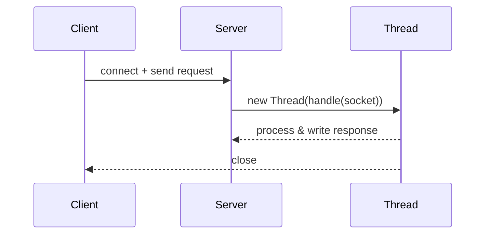

# Multithreaded Server

This folder contains an example server that creates a dedicated thread for each accepted client connection. It's useful for understanding per-connection concurrency and thread lifecycle.

Files
- `Server.java` — accepts connections and spawns a new `Thread` for each socket.
- `Client.java` — a basic client used to exercise the server.

How it works (short)

- The server listens on a configured port and calls `ServerSocket.accept()`.
- For every accepted `Socket`, the server instantiates a `Runnable` (or lambda) and starts a new `Thread` to handle the request.

Sequence diagram



Pros

- Very simple to implement and reason about.
- Low latency for small numbers of concurrent clients.

Cons and limitations

- Not suitable for high-concurrency: thread-per-connection can exhaust system threads and memory.
- Thread creation overhead impacts short-lived connections.

Tuning / improvements

- Use socket timeouts to avoid stuck threads: `socket.setSoTimeout(ms)`.
- Limit maximum concurrent connections at accept-time or use a semaphore to gate new threads.
- For production, prefer a thread pool when concurrency grows.

Run

```
cd Multithreaded
javac Server.java Client.java
java Server

# In another terminal
java Client
```

Debugging tips

- Log thread ids and timestamps for request start/end to identify contention.
- Use `jstack <pid>` to inspect thread states if the server hangs.
