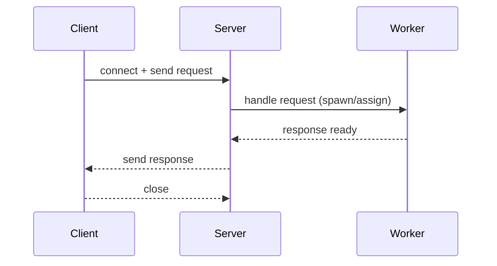

# Multithreaded WebServer - Java Example Collection

This repository contains three small Java server implementations that illustrate different approaches to handling client connections and concurrency:
- `SingleThreaded/` — handles connections serially on the main thread.
- `Multithreaded/` — spawns a new thread for every accepted connection.
- `ThreadPool/` — uses a fixed-size thread pool to limit concurrent workers.
Purpose

- Teach concurrency trade-offs (latency vs. throughput vs. resource usage).
- Provide runnable code and diagrams to reason about behavior under load.
Prerequisites

- Java JDK 8 or newer installed and available on `PATH`.
Quick run (example)

```
cd SingleThreaded
javac Server.java Client.java
java Server    # starts server on configured port (default 8080)

# In another terminal
java Client    # sends a simple request to the server
```
Repeat for `Multithreaded` and `ThreadPool`.

Connection handling overview

```mermaid
flowchart LR
  Client --> LB[OS accept()]
  LB --> ST[SingleThreaded Server]
  LB --> MT[Multithreaded Server]
  LB --> TP[ThreadPool Server]
  ST -->|handle on main thread| Handler1((handler))
  MT -->|spawn worker thread| MTW((per-connection worker))
  TP -->|submit task| Pool((fixed thread pool))
```
Sequence (request lifetime)


Where to look

- `SingleThreaded/Server.java` — simple loop with `accept()` + handle
- `Multithreaded/Server.java` — `new Thread` per connection
- `ThreadPool/Server.java` — uses `Executors.newFixedThreadPool`

Next steps

- See the per-directory READMEs for architecture, sequence diagrams, tuning tips, and sample workloads.

If you'd like, I can also add a simple benchmark script and example workload to compare latency and throughput across the three implementations.
# Multithreaded Web Server Project

This project demonstrates three types of Java web servers:
- Single-threaded
- Multithreaded
- Thread pool-based

## Project Structure

```
Multithreaded/
    Client.java
    Server.java
SingleThreaded/
    Client.java
    Server.java
ThreadPool/
    Server.java
```

## How to Run

### Prerequisites

- Java JDK (8 or above)
- Apache JMeter (for load testing)

### Compile the Servers

Open a terminal in the project directory and run:

```powershell
# For SingleThreaded server
cd SingleThreaded
javac Server.java Client.java

# For Multithreaded server
cd ..\Multithreaded
javac Server.java Client.java

# For ThreadPool server
cd ..\ThreadPool
javac Server.java
```

### Start a Server

Example for starting the Multithreaded server:

```powershell
cd Multithreaded
java Server
```

The server will start and listen on the default port (usually 8080 or as specified in the code).

### Run a Client (Optional)

You can run the provided `Client.java` to send requests:

```powershell
java Client
```

## Testing with JMeter

1. Download and install [Apache JMeter](https://jmeter.apache.org/).
2. Open JMeter and create a new test plan.
3. Add a Thread Group and set the number of users (threads) and loop count.
4. Add an HTTP Request sampler:
    - Set the server name or IP (e.g., `localhost`)
    - Set the port (e.g., `8080`)
    - Set the path (e.g., `/`)
5. Add a Listener (e.g., View Results Tree) to see the results.
6. Start the server you want to test.
7. Click the Start button in JMeter to begin the test.

## Notes

- Make sure the server is running before starting the JMeter test.
- You can compare the performance of different server implementations by running JMeter tests against each one.
