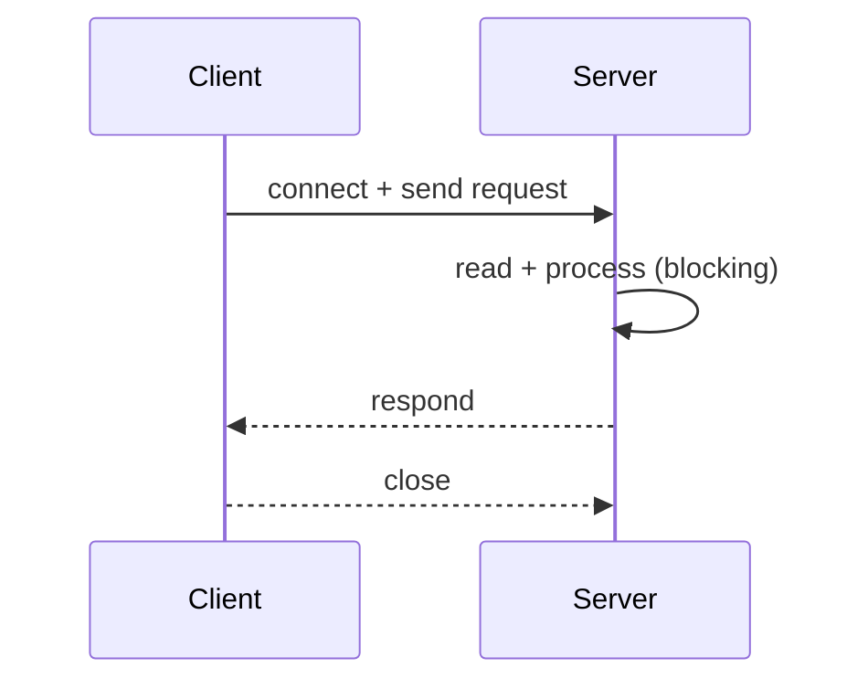

# Single-threaded Server

This folder contains a minimal server implementation that handles client connections serially on the main thread. It is intended as a baseline for comparison.

Files
- `Server.java` — main loop: `accept()` → handle → close.
- `Client.java` — example client for exercising the server.

Behavior

- The server accepts a client, processes the entire request on the same thread, sends the response, then returns to accept the next connection.
- This model is deterministic and easy to debug but cannot serve more than one client concurrently.

Sequence diagram



When to use

- Educational examples and debugging.
- Small utilities or controlled environments where concurrent clients are not expected.

Limitations

- High latency and poor throughput under concurrent load.

Run

```
cd SingleThreaded
javac Server.java Client.java
java Server

# In another terminal
java Client
```
